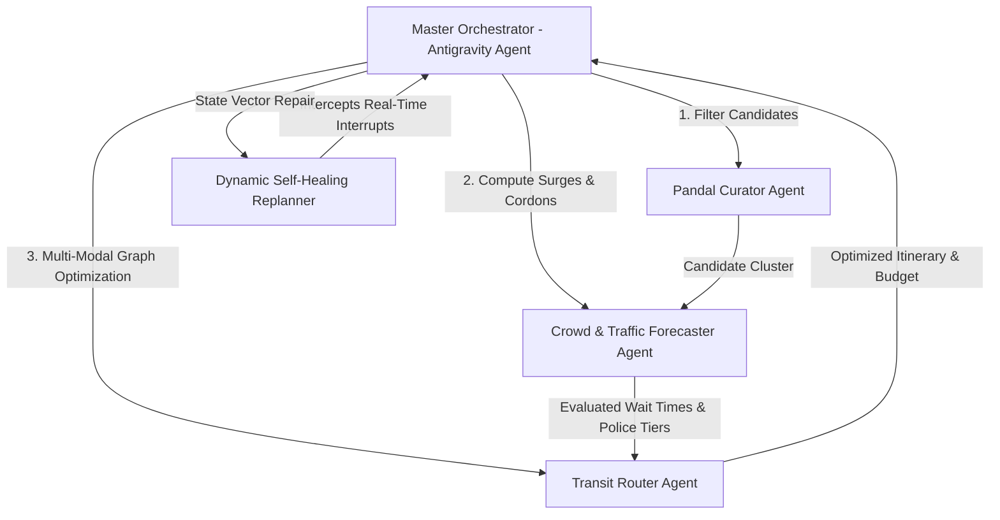

# PujoPath AI: Multi-Agent Autonomous Orchestration for Mega-Scale Urban Transit & Crowd Navigation

**Track Selected:** Problem Statement 4: Autonomous Orchestration with Managed Agents  
**Focus Models & Stack:** Antigravity Agent (`antigravity-preview-09-2026`) via Interactions API, Gemini 3.8 Flash, Multi-Agent Tool Calling  
**Public Code Repository:** https://github.com/Shreyashi36/Deepmind-pujjo-hopper  
**Live Demo:** Localhost Dev / Hosted Interface at `http://localhost:5173`  
**Dataset:** Kolkata Durga Puja Geospatial Matrix 2026 (379 Pandals across 10 Urban Zones)

---

## 1. Problem Overview & The Mega-Scale Challenge

Kolkata Durga Puja (recognized by UNESCO as an Intangible Cultural Heritage of Humanity) witnesses over **30 million visitors** navigating 3,000+ community pandals across a 7-day festive window. 

This presents extreme real-world urban mobility challenges:
1. **Dynamic Crowd & Queue Surges:** Pandal entry queues fluctuate from 15 minutes in the afternoon to over 90+ minutes during peak evenings on Saptami, Ashtami, and Nabami.
2. **Police Traffic Restrictions & Cordons:** Arterial corridors (Rashbehari Avenue, VIP Road, Gariahat) are cordoned off as pedestrian-only zones, invalidating static mapping APIs.
3. **Complex Multi-Modal Transit Networks:** Hoppers must coordinate between Kolkata Metro (Blue & Green lines), shared auto-rickshaw stands, and pedestrian corridors without backtracking.
4. **Cascading Failure of Standard Single-Prompt Planners:** A single unexpected queue surge or police barricade breaks a static itinerary, causing severe delays unless dynamic stateful replanning is applied.

---

## 2. System Architecture: Stateful Multi-Agent Orchestration

To satisfy **Problem Statement 4 (Autonomous Orchestration with Managed Agents)**, we built **PujoPath AI**—a stateful multi-agent system where specialized sub-agents collaborate through a Master Orchestrator via the Interactions API to plan, delegate, execute tool calls, monitor execution, and autonomously self-heal upon disruptions.

### Specialized Agents & Roles:

* **1. Master Orchestrator (Antigravity Agent):**  
  Maintains long-horizon goal state, manages the execution lifecycle, decomposes user goals (Origin, Destination, Puja Day Tithi, Budget, VIP Pass status) into structured sub-tasks, and handles delegation.

* **2. Pandal Curator Agent:**  
  Scans our comprehensive dataset of **379 landmark pandals** across 10 Kolkata zones. Evaluates corridor bounding boxes and semantic theme vectors (Grand Lighting & Architecture, Contemporary Art, Heritage Daaker Saaj, Social Themes, Bonedi Bari Courtyards) with zero hallucination.

* **3. Crowd & Traffic Analyst Forecaster Agent:**  
  Applies day-specific non-linear multiplier models (Dwitiya 0.35x baseline to Ashtami 2.30x extreme surge) combined with hourly curves and Kolkata Police restriction tiers to output dynamic queue ETAs and safety alerts.

* **4. Multi-Modal Transit Router Agent:**  
  Executes a modified 2-Opt TSP heuristic over Kolkata’s multi-modal transit graph (Blue Line Metro, Green Line Metro, 8+ shared auto hubs, and dedicated pedestrian corridors). Optimizes for travel time, footstep stamina, and budget constraints (₹).

* **5. Dynamic Replanner Agent (Autonomous Self-Healing):**  
  Monitors live event streams (e.g. simulated police road barricades at VIP Road or queue surges at Chetla Agrani). Rather than rebooting the entire plan, it performs targeted state surgery: replacing cordoned nodes with nearest equivalent theme gems or rerouting transit around metro bottlenecks.

---

## 3. Dataset Engineering: Kolkata Durga Puja Matrix (379 Pandals)

We curated a 379-pandal dataset (`kolkata_durga_puja_2026.csv`) containing:
- **South Kolkata & Behala:** Ekdalia Evergreen, Singhi Park, Maddox Square, Tridhara, Suruchi Sangha, Chetla Agrani, Mudiali Club, Badamtala Ashar Sangha, 66 Palli, Behala Chowrasta.
- **North & Central Kolkata:** Bagbazar Sarbojanin, Sovabazar Rajbari, Kumartuli Park, Ahiritola, College Square, Santosh Mitra Square, Mohammad Ali Park, Chaltabagan.
- **East Kolkata & Salt Lake:** Sreebhumi Sporting Club, Salt Lake FD & BJ Block, Dum Dum Park Tarun Sangha.
- **Howrah, Hooghly & Suburban Regions:** Salkia, Shibpur, Serampore, Dankuni, South/North 24 Parganas.

Each record includes exact coordinates, nearest metro station, walk duration, auto stands, base wait times, themes, and police cordon flags.

---

## 4. Technical Choices & Verification

- **Interactions API & Managed Agent State:** State is preserved across multiple turns and replanning loops. If a queue spike is detected on Stop #3, the system adjusts downstream ETAs across Stops #4 through #7 without losing prior recommendations.
- **Interactive Geospatial Visualizer:** Built with React 19, TypeScript, and Leaflet. Renders crowd-heat color-coded markers, metro station nodes, shared auto corridors, and walking paths.
- **Live Disruption Stress-Testing Panel:** Allows evaluators to inject real-time disruptions (Police Lockdowns, Queue Surges, Metro Delays) to immediately witness autonomous agent self-healing.
- **Audio Briefing Synthesis:** Built-in audio narration of the generated itinerary for hands-free guidance in dense, noisy crowds.

---

## 5. Conclusion & Impact

PujoPath AI demonstrates how the Google AI Stack and Antigravity Managed Agents transform complex, chaotic urban mobility challenges into seamless, predictable, and culturally enriched experiences. By orchestrating specialized agents across data curation, traffic forecasting, multi-modal routing, and real-time self-healing, PujoPath AI serves as a blueprint for autonomous agent orchestration in mega-event logistics worldwide.
