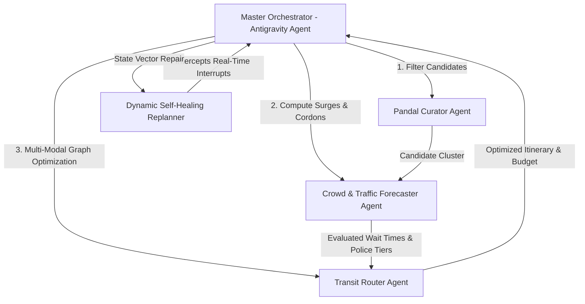

# 🪔 PujoPath AI: Autonomous Multi-Agent Durga Puja Navigator

[](https://www.kaggle.com/competitions/google-deep-mind-hyderabad-hackathon)
[](#track-4-autonomous-orchestration)
[](#tech-stack)
[-blue.svg)](./data/kolkata_durga_puja_2026.csv)

**PujoPath AI** is an intelligent, stateful multi-agent system designed for the **Google DeepMind Hyderabad Hackathon (Track 4: Autonomous Orchestration with Managed Agents)**. It solves the massive urban mobility challenge of Kolkata Durga Puja—navigating 30+ million visitors across 3,000+ pandals, dynamic crowd surges, police vehicular cordons, and multi-modal transit networks (Kolkata Metro, shared auto-rickshaws, and pedestrian walking corridors).

---

## 🌟 Key Features

- 🤖 **Autonomous Multi-Agent Architecture:** Master Orchestrator delegates tasks to specialized sub-agents (*Pandal Curator*, *Crowd & Traffic Forecaster*, *Multi-Modal Transit Router*, and *Dynamic Replanner*).
- 📍 **Comprehensive Dataset (379 Pandals):** Covers all major Kolkata zones (South Kolkata, North Kolkata, Central Kolkata, East Kolkata, Salt Lake, Behala, Howrah, Hooghly, and 24 Parganas).
- 🚇 **Multi-Modal Transit Integration:** Optimizes routes across Kolkata Metro (Blue & Green lines), shared auto-rickshaw routes, and pedestrian-only corridors with cost estimation (₹) and walking metrics.
- ⚡ **Dynamic Self-Healing (Replanning):** Real-time recovery from live disruptions (e.g. police road barricades, queue surges, metro delays) without losing itinerary state.
- 🗺️ **Interactive Visualizer:** Leaflet map with crowd-heat-coded markers, polyline route paths, audio narration, and live streaming agent thought traces.

---

## 🏗️ Multi-Agent Architecture (Track 4)



---

## 📂 Project Structure

```
├── KAGGLE_WRITEUP.md          # Official 1500-word submission report for Kaggle
├── data/
│   ├── kolkata_durga_puja_2026.csv   # 379 curated pandals with coordinates & transit
│   └── kolkata_durga_puja_2026.json  # Full JSON structured dataset
├── src/
│   ├── agents/
│   │   ├── types.ts                  # Multi-agent contracts & state vectors
│   │   ├── Orchestrator.ts           # Master Antigravity agent pipeline
│   │   ├── PandalCuratorAgent.ts     # Pandal filtering & theme scoring
│   │   ├── CrowdTrafficAgent.ts      # Temporal congestion & police cordon forecaster
│   │   ├── TransitRouterAgent.ts     # Multi-modal graph optimizer (Metro/Auto/Walk)
│   │   └── DynamicReplannerAgent.ts  # Autonomous error recovery & self-healing
│   ├── components/
│   │   ├── MapComponent.tsx          # Leaflet interactive map with custom overlays
│   │   ├── AgentVisualizer.tsx       # Real-time multi-agent execution & trace log
│   │   ├── ItineraryCard.tsx         # Step-by-step timeline, budget & audio brief
│   │   ├── SimulationControls.tsx    # Live disruption stress testing
│   │   └── PandalDetailModal.tsx     # Deep cultural backstory modal
│   ├── data/
│   │   └── kolkataData.ts            # Metro network, auto routes & pandal records
│   ├── App.tsx                       # Main dashboard layout
│   └── index.css                     # Festive dark UI styling
└── package.json
```

---

## 🚀 Quickstart & Running Locally

```bash
# Clone repository
git clone https://github.com/Shreyashi36/Deepmind-pujjo-hopper.git
cd Deepmind-pujjo-hopper

# Install dependencies
npm install

# Start the interactive development server
npm run dev
```

Open [http://localhost:5173](http://localhost:5173) in your browser.

---

## 🏆 Hackathon Alignment

- **Track:** Problem Statement 4: Autonomous Orchestration with Managed Agents
- **Google AI Models:** Antigravity Agent (`antigravity-preview-09-2026`) via Interactions API, Gemini 3.8 Flash
- **Proof of Work:** End-to-end multi-agent pipeline with real-time thought traces, tool calling, and autonomous disruption recovery.
